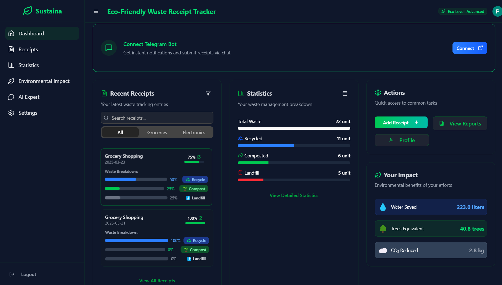
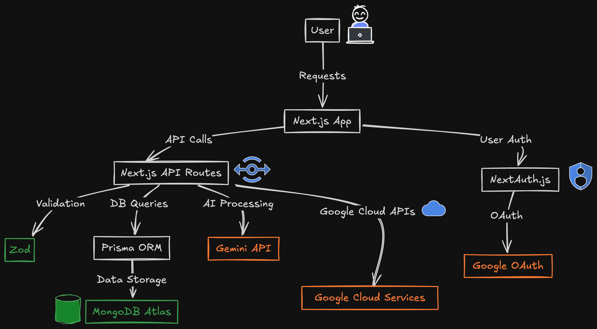
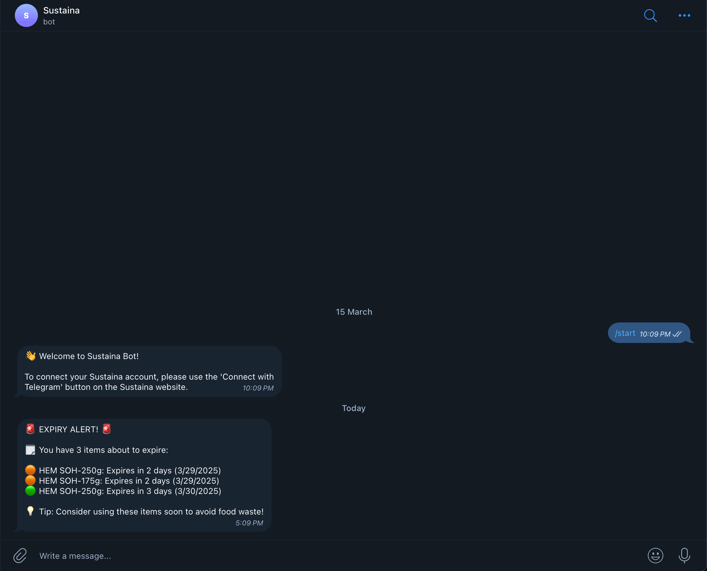
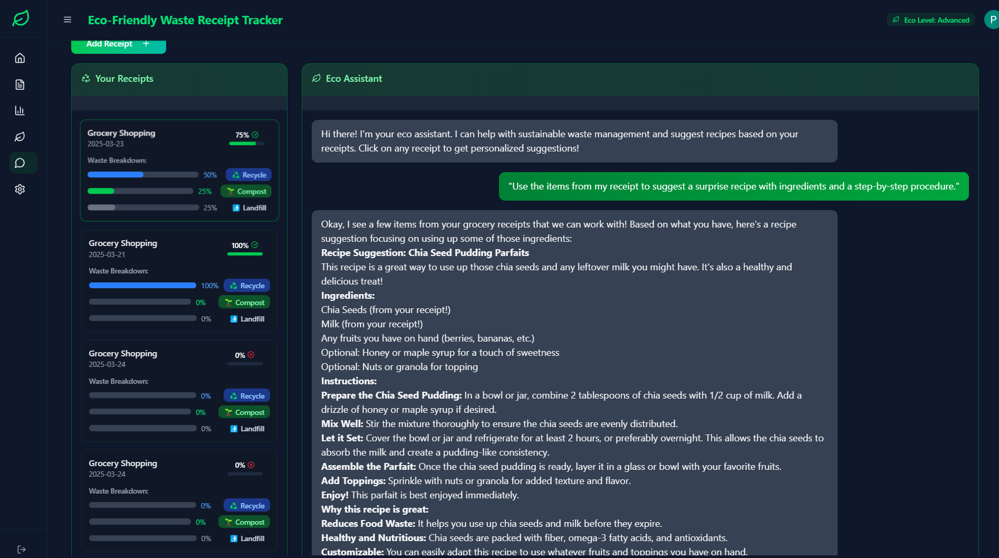

# 🌱 Sustaina: AI-powered Waste Management and Sustainability Tracking Platform



## 🚀 Overview

Sustaina is an AI-powered platform designed to optimize waste management and track sustainability efforts. It automates waste tracking, provides actionable insights, and helps users reduce waste, improve recycling rates, and achieve sustainability goals.

Sustaina aligns with **UN SDG 12: Responsible Consumption and Production**, promoting sustainable habits through AI-driven automation, chat-based notifications, and a web dashboard for advanced analytics.

---

## 🛠️ How Sustaina Works



### 1️⃣ **Automated Purchase Tracking**

- Partnered stores send receipt data directly to Sustaina.
- AI extracts key details:
  - 🏷 Product Name
  - 🏭 Manufacturer
  - ⏳ Expiry Date
  - 🔢 Quantity Purchased
  - 💰 Price (optional for spending insights)
- Users receive instant WhatsApp/Telegram notifications.

### 2️⃣ **Expiry Tracking & Smart Reminders**

- AI monitors expiry dates and sends reminders:
  - ⚡ Urgent alerts: "Your milk expires in 2 days!"
  - 📅 Weekly summaries: "5 items are expiring this week."
- Telegram bot sends reminders directly to users.



### 3️⃣ **AI-Powered Consumption Logging**

- Users log consumption via voice or text:
  - Example: "I finished the bread" removes it from tracking.
- AI suggests recipes to reduce waste.

### 4️⃣ **Manual Receipt Scanning**

- For non-partnered stores, users can scan/upload receipts.
- AI-powered OCR extracts product details.

### 5️⃣ **Web Dashboard**

- View insights like:
  - 📊 Waste reduction trends
  - 📈 Consumption habits
  - 🔄 Recycling suggestions

---

## ✨ Key Features

- ✅ **Automatic Receipt Integration**: No manual entry for partnered stores.
- ✅ **Telegram Notifications**: No app installation required.
- ✅ **Expiry Tracking & AI Suggestions**: Reduces food and product waste.
- ✅ **Voice-Based Logging**: Easy tracking via chat.
- ✅ **Manual Receipt Scanning**: For non-partnered purchases.
- ✅ **Sustainability Analytics Dashboard**: Track waste and habits.

---

## 📂 Project Structure

```
sustaina/
├── app/             # Next.js application
├── components/      # Reusable React components
├── lib/             # Utility functions and helpers
├── prisma/          # Database schema and migrations
├── public/          # Static assets
└── scripts/
      └── bot/       # Telegram bot functionality
```

---

## 🛠️ Getting Started

### Prerequisites

- **Node.js** (v18.0.0 or higher)
- **NPM** or **Yarn**
- **MongoDB** database
- **Telegram bot token** (for notifications)

### Installation

1. **Clone the repository:**

   ```bash
   git clone https://github.com/mohitmimani/sustaina.git
   ```

2. **Navigate to the project directory:**

   ```bash
   cd sustaina
   ```

3. **Install dependencies:**

   ```bash
   npm install
   ```

4. **Set up environment variables:**
   Create a `.env` file in the root directory with the following variables:

   ```env
   # MongoDB connection
   DATABASE_URL="mongodb+srv://<username>:<password>@cluster.mongodb.net/sustaina?retryWrites=true&w=majority"

   # Auth.js configuration
   AUTH_SECRET="your-auth-secret"
   AUTH_URL="http://localhost:3000"

   # Telegram bot configuration
   TELEGRAM_BOT_TOKEN="your-telegram-bot-token"
   TELEGRAM_API_ID="your-telegram-api-id"
   TELEGRAM_API_HASH="your-telegram-api-hash"
   TELEGRAM_SESSION="your-telegram-session-string"

   # Google API for AI features
   GOOGLE_API_KEY="your-google-api-key"
   ```

5. **Run database setup:**

   ```bash
   npx prisma db push
   ```

6. **Start the development server:**

   ```bash
   npm run dev
   ```

   Access the web application at `http://localhost:3000`.

7. **Start the Telegram bot (in a separate terminal):**

   ```bash
   npm run bot
   ```

8. **Build for production:**
   ```bash
   npm run build
   npm run start
   ```

---

## 🌟 Demo



---

## 🛠️ Tech Stack

- **Frontend**: Next.js, React, TailwindCSS, Radix UI
- **Backend**: Next.js API routes, Prisma ORM
- **Database**: MongoDB
- **Authentication**: Auth.js
- **Notifications**: Telegram Bot API
- **AI**: Google AI SDK
- **Deployment**: Vercel/Netlify
